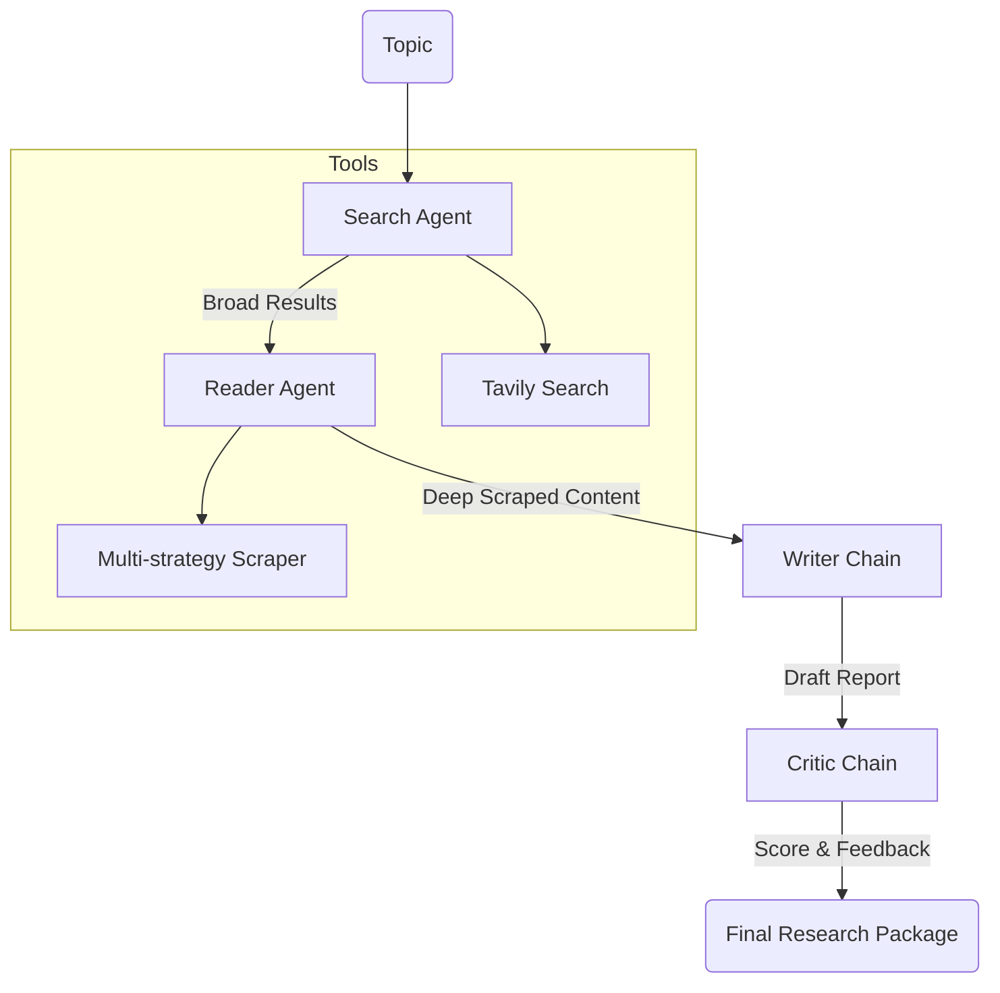

# LangChain Multi-Agent Research System

A sophisticated multi-agent orchestration system built with LangChain that automates the process of deep research. The system coordinates specialized agents to search, scrape, synthesize, and critique information to produce high-quality research reports.

## 🏗️ Full Project Architecture

The system is designed as a **Sequential Multi-Agent Pipeline**. It separates concerns by delegating specific research tasks to specialized agents and deterministic tools, ensuring high reliability and modularity.

### 🧩 System Components

#### 1. `src/tools/` (Execution Layer)
This layer contains deterministic Python functions wrapped as LangChain tools.
- **`web_search`**: Leverages the Tavily AI API to perform optimized searches and return titles, URLs, and snippets.
- **`scrape_url`**: A robust scraper employing a three-tier extraction strategy:
    - **Trafilatura**: Primary strategy for high-quality article extraction.
    - **Readability**: Secondary strategy for cleaning HTML and extracting main content.
    - **BeautifulSoup**: Fallback strategy for general page text extraction.

#### 2. `src/agents/` (Decision Layer)
Defines the logic and prompts for the specialized AI personas.
- **Search Agent**: Configured with the `web_search` tool to identify primary sources.
- **Reader Agent**: Configured with the `scrape_url` tool to extract deep data from specific URLs.
- **Writer Chain**: A prompt-driven chain that synthesizes raw research into a professional report format (Intro $\rightarrow$ Key Findings $\rightarrow$ Conclusion $\rightarrow$ Sources).
- **Critic Chain**: A quality-assurance chain that scores the report (X/10) and identifies strengths and weaknesses.

#### 3. `src/pipelines/` (Orchestration Layer)
The `pipeline.py` manages the state and the flow of data between agents:
`Topic` $\rightarrow$ `Search Agent` $\rightarrow$ `Reader Agent` $\rightarrow$ `Writer Chain` $\rightarrow$ `Critic Chain` $\rightarrow$ `Final Output`.

#### 4. `main.py` (Entry Point)
The trigger for the system, allowing users to define a research topic and launch the full pipeline.

### 🔄 Data Flow Diagram


## 🛠️ Technologies Used

- **Framework**: [LangChain](https://www.langchain.com/) (Core, Community, OpenAI)
- **LLM Integrations**: 
    - Primary: Ollama (Llama 3.2)
    - Supported: OpenAI, Groq, HuggingFace
- **Search & Scraping**: 
  - [Tavily AI](https://tavily.com/) for optimized AI search
  - `BeautifulSoup4`, `trafilatura`, `readability-lxml` for web content extraction
- **UI/Frontend**: [Streamlit](https://streamlit.io/)
- **Environment**: Python 3.12+

## 📦 Installation

### Prerequisites
- Python 3.12
- Conda (recommended)
- API Keys for your chosen LLM provider and Tavily Search

### Setup
1. **Clone the repository**
   ```bash
   git clone https://github.com/yourusername/LangChain-Multi-Agent-Research-System.git
   cd LangChain-Multi-Agent-Research-System
   ```

2. **Create and activate environment**
   ```bash
   conda create -n langagent python 3.12 -y
   conda activate langagent
   ```

3. **Install dependencies**
   ```bash
   pip install -r requirements.txt
   ```

4. **Configure Environment Variables**
   Create a `.env` file in the root directory and add your keys:
   ```env
   OPENAI_API_KEY=your_openai_key
   TAVILY_API_KEY=your_tavily_key
   # Add other provider keys as needed (GROQ_API_KEY, etc.)
   ```

## 🏃 Usage

To run the research pipeline from the command line:
```bash
python main.py
```

The system will execute the full pipeline: **Search $\rightarrow$ Read $\rightarrow$ Write $\rightarrow$ Critique** and print the final report and feedback to the console.
